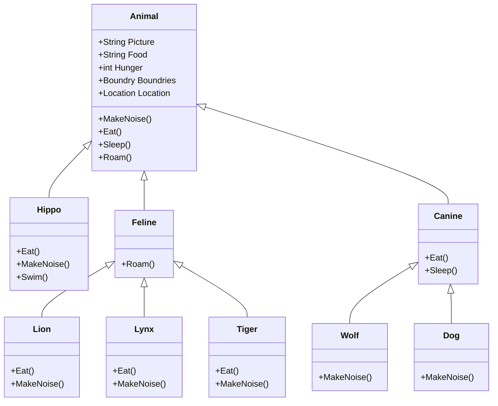

Example of Class Hierarchy:

```mermaid
classDiagram
    Animal <|-- Hippo
    Animal <|-- Feline
    Animal <|-- Canine
    
    Animal : +String Picture
    Animal : +String Food
    Animal : +int Hunger
    Animal : +Boundry Boundries
    Animal : +Location Location

    Animal: +MakeNoise()
    Animal: +Eat()
    Animal: +Sleep()
    Animal: +Roam()

    class Feline{
      +Roam()
    }
    
    Feline <|-- Lion
    Feline <|-- Lynx
    Feline <|-- Tiger
    
    class Canine{
      +Eat()
      +Sleep()
    }

    Canine <|-- Wolf
    Canine <|-- Dog
    
    class Hippo{
      +Eat()
      +MakeNoise()
      +Swim()
    }
    class Wolf{
      +MakeNoise()
      
    }
    class Dog{
      +MakeNoise()
      
    }
    class Lion{
      +Eat()
      +MakeNoise()
      
    }
    class Lynx{
      +Eat()
      +MakeNoise()
      
    }
    class Tiger{
      +Eat()
      +MakeNoise()
      
    }
```